# Detecting Community-Level Migration Patterns in Chicago Using Census Tract-level Inflow Data 

Zixuan Zhou
MACS 30100

---
# Motivation

- **Main Question**: Can we detect community-level migration patterns in Chicago using census data, and can socio-economic variables predict these patterns?
    - **Why it matters**: where demographic shifts impact economic and social dynamics

- **Existing Literature**
    1. **Greenlee (2019)** examines longitudinal household-level data to connect origin/destination mobility flows with income and neighborhood sociodemographic change trajectories

---
# Motivation - Continued
- **Existing Literature**

    2. **DeLuca (2018)** explores neighborhood change and residential mobility in Chicago by analyzing how neighborhood changes influence household-level decisions to move and how these dynamics shape residential patterns over time
    3. **Yoon (2023)** provides a model to detect socio-economic and racial changes in Chicago, using heterogeneous **graph networks** to analyze community evolution, including racial displacement, poverty, and unemployment trends in Chicago neighborhoods

- **Motivation**
    - Computational methods are less employed in this field, but they can generate meaningful results for large-scale geographic-socioeconomic data
    - Detecting tract-level in-migration patterns and using socio-economic factors to predict such factors
---

# Design

- **Two-Step Modeling Approach**:
    1. **Clustering:** using only variables **related** to inflow migration from 2018
    Goal: Identify distinct community migration patterns 
    2. **Classification:** train on variables **unrelated** to inflow migration from 2018; predict pattern using data from 2023
- **Goal:** Predict the identified migration patterns using other neighborhood features, and compare changes across time

---
# Design - Continued
- **Why Clustering as a first step?**
    - Our data does not have well-defined labels, and there are too many variables related to inflow migration
    - We want **fewer dimensions for better interpretability**; we also hope to detect natural patterns - understanding the interplay between variables that characterize different migration patterns
    - Unsupervised methods (clustering and PCA) naturally discover patterns in migration without pre-defined labels

---

# Data

## Data Collection
Census data is often messy and requires additional steps for data collection. 

- **Data Source**:
    - **American Community Survey (ACS):** 2018 & 2023, accessed via Census API, with 2018 data for comparison
    - **Transportation:** information on whether a region has railways. Accessed via Chicago Transit Authority (CTA)
    - **Geographic Shapes**: Chicago census tract level .shp files. Accessed via the [Census Bureau](https://www.census.gov/geographies/mapping-files/time-series/geo/tiger-line-file.html)
    - **Complimentary census data:** census data from the [Urban Displacement Project](https://github.com/urban-displacement/displacement-typologies)

---
## Data Collection - Continued
- **Selected Variables for Processing:**
    - Tract identifiers (FIPS code, year, county ID, state ID etc.)
    - Socioeconomic indicators: median home value, median rent, population, median income, education levels, **inflow migration by origin and income levels** etc.
    - **Changes** in housing price, income levels, and low-income households since last survey period
    - Transit data

- Example for example variables from ACS (see below)
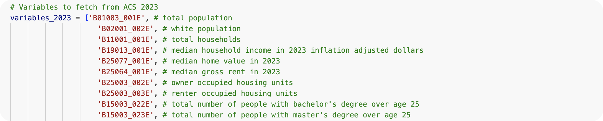

---
## Data Collection - Continued
- **Data Size**:
    - Raw feature space:
        - ACS: ~ 3.5 million on a yearly basis, ~3600 variables for both years (See the [ACS codebook 2023](https://api.census.gov/data/2023/acs/acs1/variables.html) for reference)
    - After Variable Selection:
        - ACS: 3815 samples (tract-year pairs from both 2018 and 2023) with 84 variables
        - Transit data: 444 samples, converted to a binary indicator if a tract has direct access to rails
        - Geographic shape files are not preprocessed

---

- **Data Examples**:
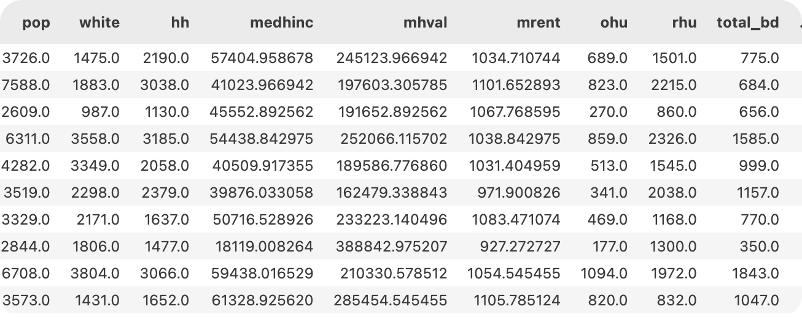

---

## Preprocessing and Feature Engineering

- **Preprocessing**:
    - Cleaning: Removed negative values and duplicates; imputed for missing values; removed outliers
    - Adjusted all 2023 price levels to 2018 price levels
    - Performed log transformation on price-related variables to address skewness
- **Feature Engineering**
    - Computed for proportion/ratio variables
    - Computed for variables that represent changes since last survey period, such as percentage change in rental prices
- **Final output:** 36 variables on inflow migration, and 46 others (socioeconomic indicators, tract or year identifiers)

---
- **More data examples**
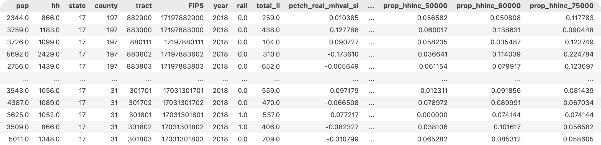

---

# Model Training

## PCA

- **Goal:**
    - better understand the aspects our features represent
    - Reduce dimension for clustering to avoid the curse of dimensionality
- **PCA Parameters**:
    - PCA with explained variance threshold - 90%
    - Reduced dataset dimensionality from 36 features to 6 components
- Graph showing successful separation - no apparently linearity between the PCs

---
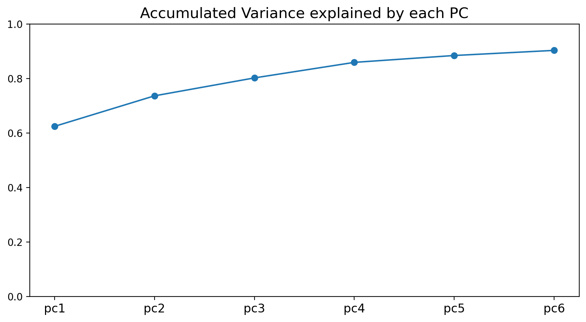

---
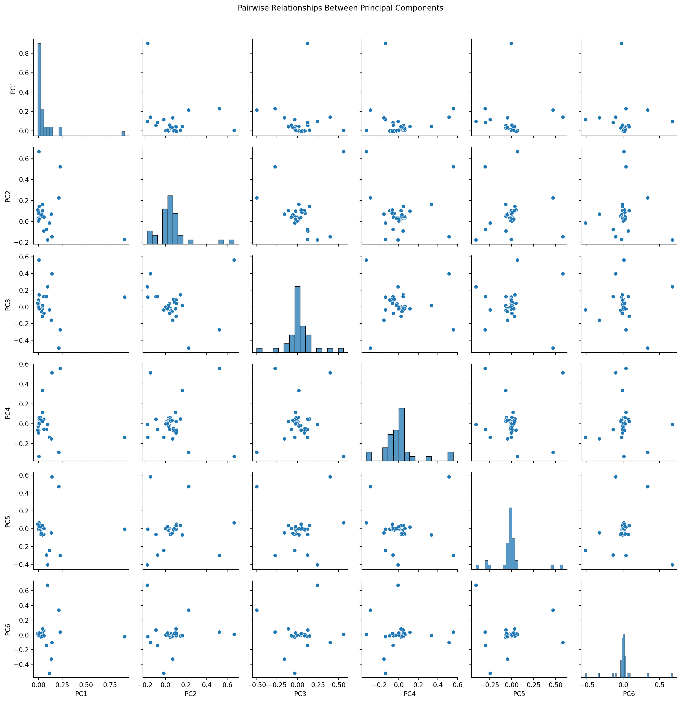

---
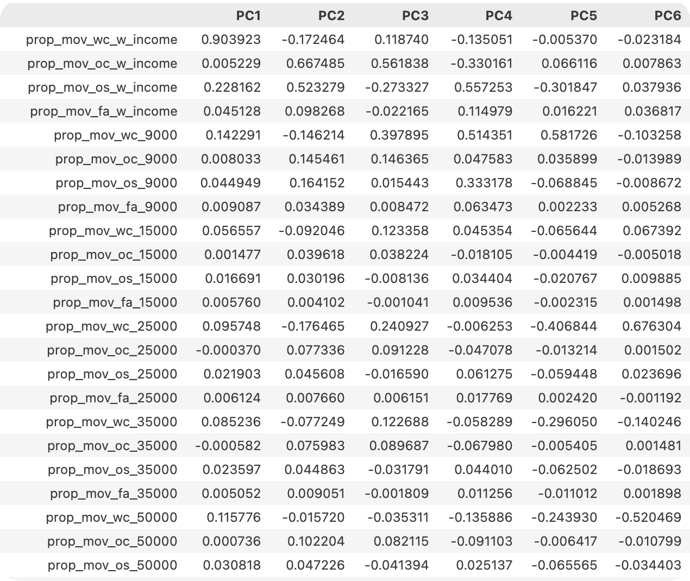

---
## PCA - Continued
- **Interpreting the PCs**
    - **PC1: LOCAL MIGRATION**
        - Extremely high loading on overall within-county migration; moderate loading on within-county high-income migration
    - **PC2: EXTERNAL MIGRATION**
        - Strongly driven by out-of-state and out-of-county migration and out-of-state migration
    - **PC3: REMOTE LOW-INCOME MIGRATION VS. LOCAL HIGH-INCOME MIGRATION**
        - Positive loadings on low-income migration ($9K, 0.40)
        - Strong negative loading on $76K+ within-county migration (-0.49)

---
## PCA - Continued
- **Interpreting the PCs**
    - **PC4: LOW-INCOME MIGRATION DESTINATION**
        - Strong positive loadings on $9K within-county (0.51) and out-of-state migration (0.56); Negative loadings on high-income migration categories
        - Areas with significant low-income migration from both local and distant sources
    - **PC5: INCOME EXTREMES**
        - High positive loading on $9K within-county (0.58) and $76K+ within-county (0.47)
        - Strong negative loadings on middle-income migration
        - Captures areas with both very low and very high income in-migration 
    - **PC6: LOCAL LOW-INCOME MIGRATION VS. LOCAL MODERATE-INCOME MIGRATION**
        - Very high positive loading on $25K within-county (0.68); strong negative loading on $50K within-county (-0.52)

---
## PCA - Continued
- **Downsides:** although reducing dimension to 6 achieves good balance between dimension complexity and interpretability, some of the PCs appear to measuring overlapping attributes, and are hard to interpret (for instance, PC3 is essentially a ratio)

---

## Clustering

- **Selecting optimum number of clusters**
    - Experimented two models, K-means and KMedoids using the reduced-dimension data
    - Cluster numbers are determined using the Elbow Method and evaluated using Silhouette Score
    - Difference random seeds produce similar results
    - Optimum K:
        - K-means performs better in terms of silhouette scores
        - No sharp elbow in graph, but after K=5, an additional cluster produce less additional value
        - To balance interpretability and cluster quality, we may choose between K = 3 or K = 5; descriptive statistics on the mean of each PCs within cluster shows that it’s easier to interpret across-cluster difference when K = 5

---
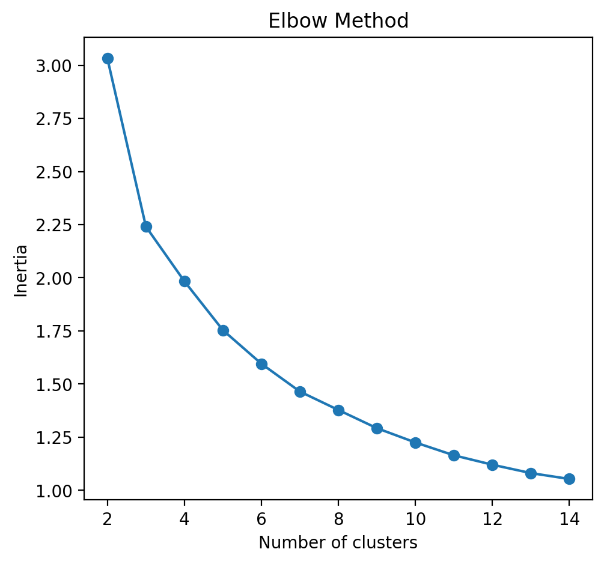

---
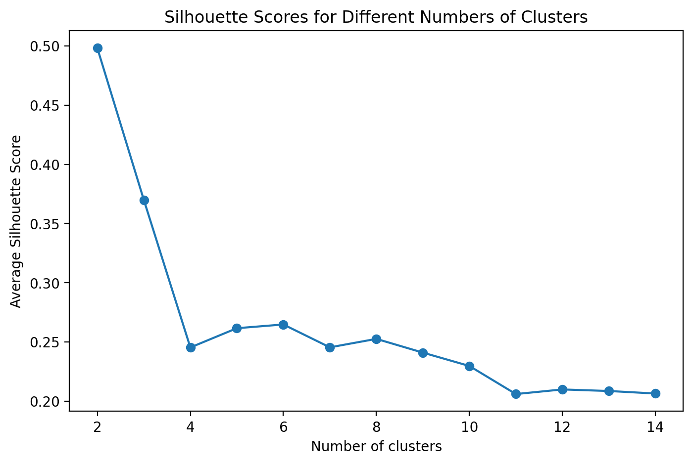

---
## Clustering - Continued
- **Understanding cluster representations**
    - The descriptives of the PCs already gave us some information
    - Further check: aggregate the variables before PCA transformation by cluster - variables indicating place of origin and income levels

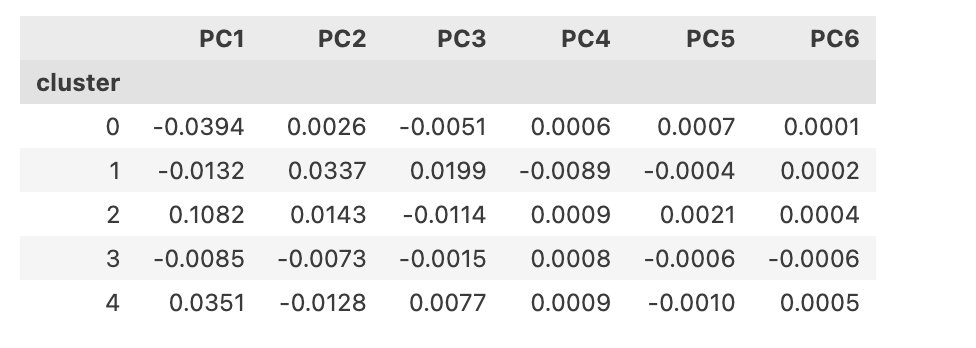

---

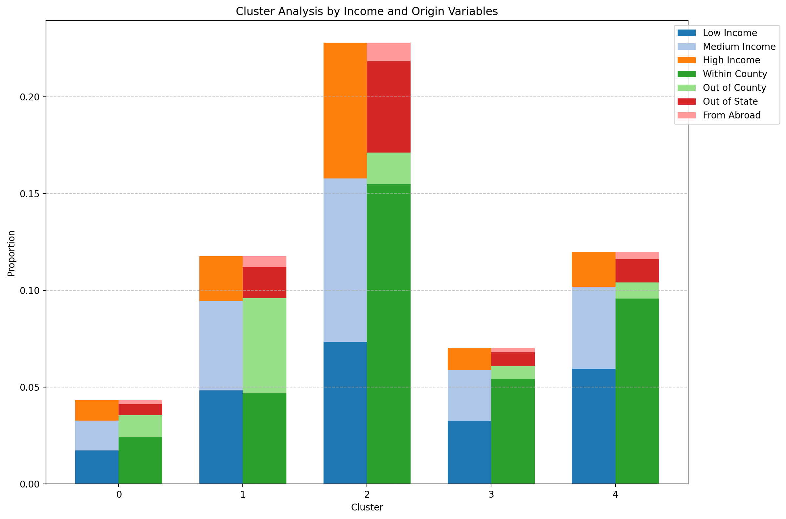

---

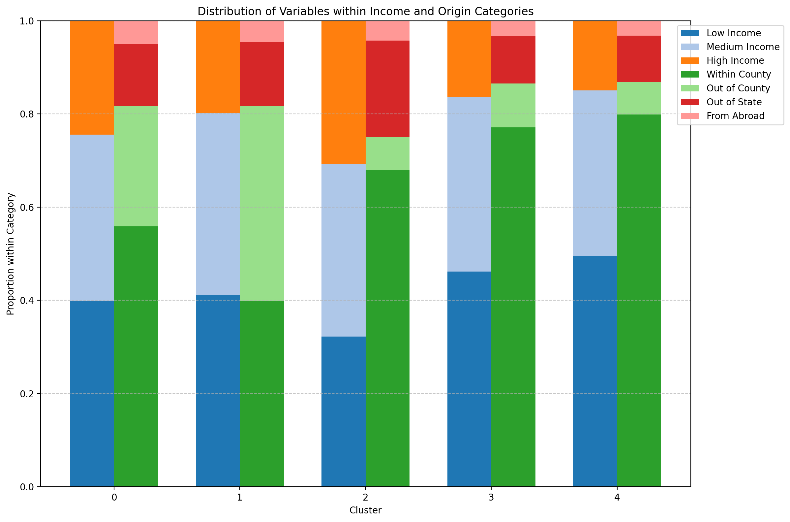

---
## Clustering - Continued
- **Tentative labeling:**
    - 0 - minimal inflow, attracts extreme population
    - 1 - moderate inflow, external working-class magnet
    - 2 - high inflow, internal high-income magnet
    - 3 - low inflow, attracts internal working-class
    - 4 - moderate inflow, internal working-class magnet

---
## Sideline Task: Machine Learning for Predicting 2023 Inflow Types

- **Features used:** variables in the prepared data that’s unrelated to inflow migration, besides region identifiers
- **Labels:** clusters generated through the previous step
- Normalized numeric values besides categorical variables (”rail” indicating whether the tract has direct access to rail)
- Used SVMSMOTE oversampling to handle **class imbalance**
- Models explored:
    - RF; fine-tuned using Random Search
    - XGBoost; fine-tuned using Random Search
    - Ensemble models: Stacking and Voting classifier

---
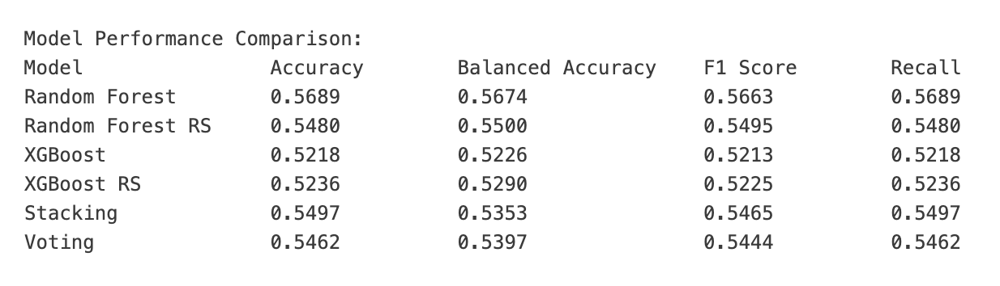

---
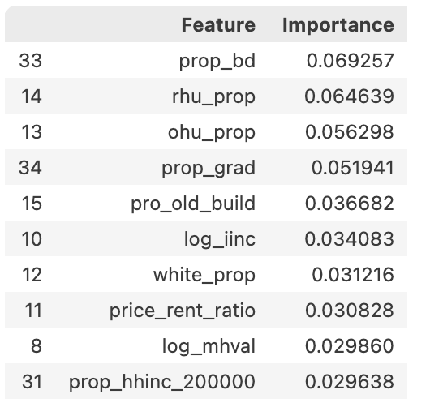

- Top 10 most predictive features: the most predictive features are ‘prop_bd’ (the proportion of individuals that have a bachelor degree) and ‘rhu_prop’ (proportion of renter occupied units)

---

# Analysis

- Changes in cluster type
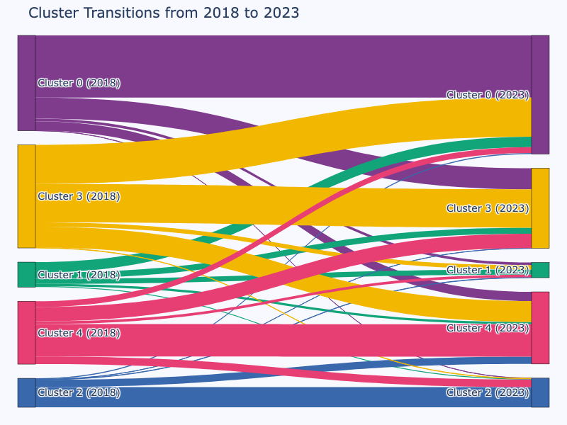

---
- Change in key features, 2018 - 2023
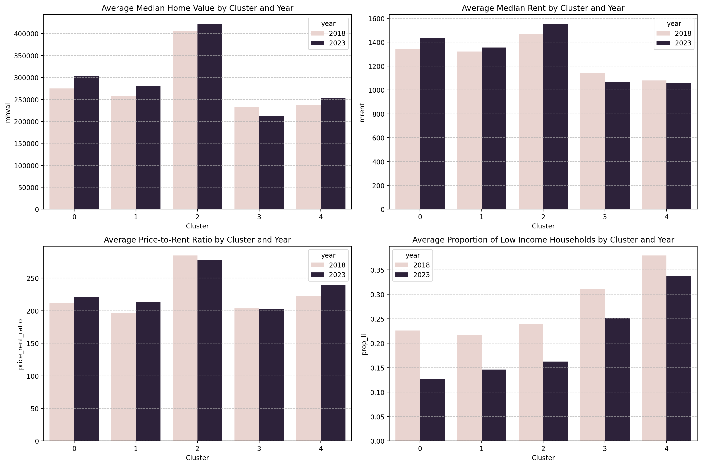

---
- Changes in key features for tracts that experienced certain transitions
- **Recall the labeling:** 0 - minimal inflow, attracts extreme population; 1 - moderate inflow, external working-class magnet; 2 - high inflow, internal high-income magnet; 3 - low inflow, attracts internal working-class; 4 - moderate inflow, internal working-class magnet
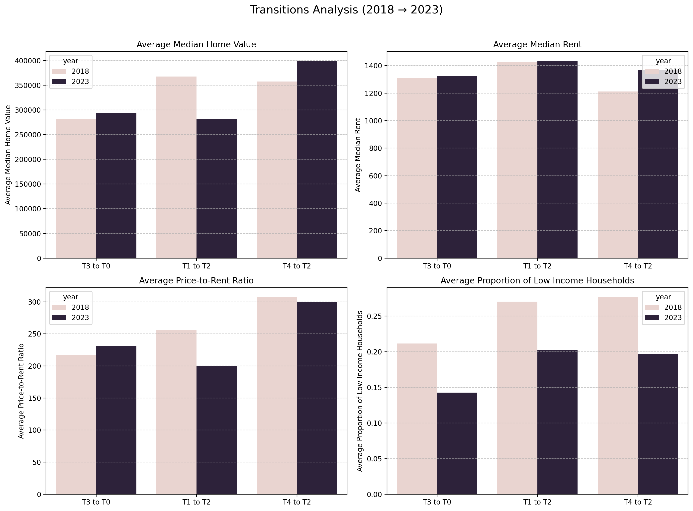

---
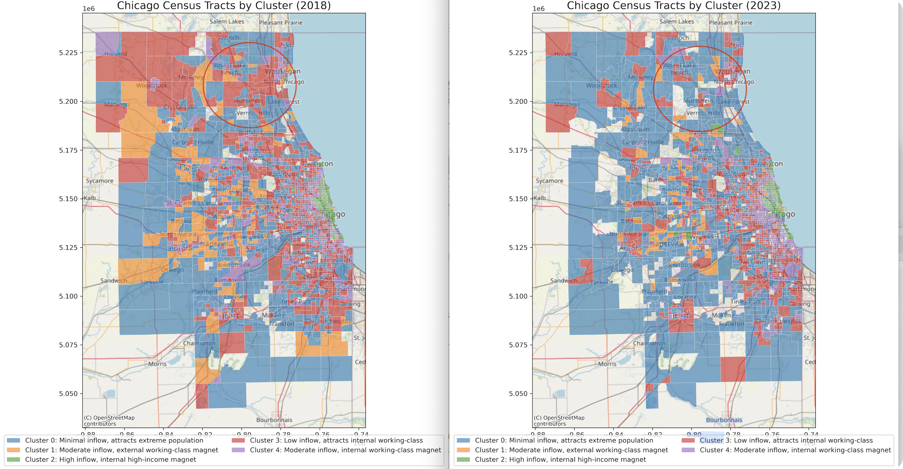

---
# References
- Greenlee, Andrew J. 2018. “Assessing the Intersection of Neighborhood Change and Residential Mobility Pathways for the Chicago Metropolitan Area (2006–2015).” Housing Policy Debate 29 (1): 186–212. doi:10.1080/10511482.2018.1476898.
- DeLuca, Stefanie. 2018. “Residential Mobility and Neighborhood Change in Chicago.” Housing Policy Debate 29 (1): 213–16. doi:10.1080/10511482.2018.1524447.
- Kim, Namwoo, Hyeyeong Lee, and Yoonjin Yoon. 2023. “A Heterogeneous Attention Network Model for Longitudinal Analysis of Socioeconomic and Racial Inequalities in Urban Regions: Evidence from Chicago, IL.” In Proceedings of the 31st ACM International Conference on Advances in Geographic Information Systems, 1–4. Hamburg Germany: ACM. doi.org/10.1145/3589132.3625650.
